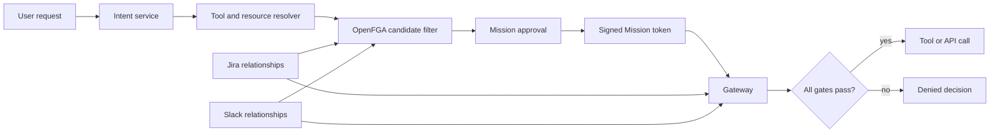

# OpenFGA Mission Gateway

Reference Go implementation of a policy enforcement point for delegated agent
actions. A Mission gives a dedicated agent a short-lived, explicit subset of a
user's current authority; the gateway evaluates that subset before every tool
or API call.

It does not turn a user's broad application access into an agent bearer token.

## The Model

A Mission binds:

- a requester: `user:alice`;
- a workload identity: `agent:triage`;
- exact action and resource grants;
- expiry, state, and version; and
- optional approval before an external side effect.

The gateway allows a request only when every gate passes:

| Gate | Evaluated from | Example |
| --- | --- | --- |
| Token and lifecycle | Signed Mission token and Mission service | Signature is valid; Mission is active, current, and unexpired. |
| Agent binding | Token and OpenFGA | `agent:triage` is the Mission executor. |
| Current base access | OpenFGA source graph | Alice can still read `APOLLO-17`. |
| Delegated scope | OpenFGA Mission tuples | This Mission permits a read of `APOLLO-17`, not every Jira issue. |
| Egress approval | Mission service | Alice approved the Slack message preview. |

Any failed gate blocks the call and records a structured decision with the
failed check.

## Example

> Read Jira issue `APOLLO-17` and post a summary in `#product`.

An upstream intent service and resolver turn that request into canonical IDs.
Those systems are outside this repository.

```json
{
  "grants": [
    {
      "action": "jira.issue.read",
      "resource": "jira_issue:APOLLO-17"
    },
    {
      "action": "slack.message.post",
      "resource": "slack_channel:product"
    }
  ],
  "requires_egress_approval": true
}
```

On approval, the Mission service writes the narrowed relationships below. The
source graph remains separate from the delegation graph.

```text
# Existing application authority
user:alice              can_read       jira_issue:APOLLO-17
user:alice              can_post       slack_channel:product

# Mission-specific delegation
agent:triage            executor       mission:apollo-17-product-summary-v1
jira_issue:APOLLO-17    read_issue     mission:apollo-17-product-summary-v1
slack_channel:product   post_channel   mission:apollo-17-product-summary-v1
```

`model.fga` defines those relations. `tuples.json` holds the durable Jira and
Slack relationships used by the example.

## Request Flow



The resolver may use semantic or keyword search to find candidates. FGA then
filters the resolved IDs against the requester's current access. FGA is not
used for natural-language interpretation or permission synchronization.

## Components

| Component | Responsibility |
| --- | --- |
| Intent service and resolver | Interpret the request and produce canonical action/resource candidates. |
| `FilterAuthorizedCandidates` | Remove candidates the requester cannot currently access. |
| `MissionService` | Create, approve, revoke, complete, and issue a signed token for Missions. |
| OpenFGA | Store source relationships and the Mission's explicit action/resource scope. |
| `Gateway` | Enforce every gate immediately before a downstream call and retain the decision audit log. |

The included `OpenFGAHTTP` adapter calls OpenFGA's standard Check and Write
APIs. Tests use an in-memory evaluator that implements only the model in this
repository; it is not a general OpenFGA evaluator.

## Run the Demo

Requires Go 1.23+.

```sh
git clone https://github.com/Siddhant-K-code/openfga-mission-gateway.git
cd openfga-mission-gateway
go test ./...
go run ./cmd/demo
```

The demo proves the following sequence:

| Step | Expected result |
| --- | --- |
| Candidate filtering | `APOLLO-17` remains; an issue Alice cannot read is removed. |
| Scoped Jira read | Allowed. |
| Slack post before preview approval | Denied. |
| Slack post after requester approval | Allowed. |
| Slack post to a different channel | Denied by Mission scope. |
| Jira permission revocation | The next read is denied by current base access. |

## Integration Shape

1. Resolve the user request to canonical resource IDs.
2. Filter those candidates with `FilterAuthorizedCandidates`.
3. Create a draft with `CreateMissionInput`, including the requester, agent,
   grants, expiry, and egress policy.
4. Have the requester approve the Mission, then give the issued token to the
   agent runtime.
5. Call `Gateway.Authorize` before each downstream tool or API invocation.
6. Revoke or complete the Mission when the work ends. Future calls are denied.

## Repository Layout

| Path | Purpose |
| --- | --- |
| `cmd/demo` | Runnable Jira-to-Slack flow. |
| `internal/mission` | Mission service, gateway, FGA adapters, and contract tests. |
| `model.fga` | OpenFGA authorization model. |
| `tuples.json` | Example Jira and Slack source relationships. |

## Deliberate Omissions

- Intent classification, embeddings, and resource search.
- OAuth, SaaS connectors, MCP transport adapters, and permission-sync jobs.
- Persistence, UI, child Missions, and cross-domain delegation.

## License

MIT
