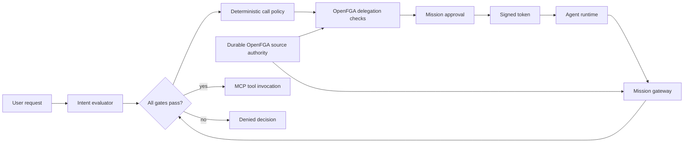

# OpenFGA Mission Gateway

Reference Go implementation of a policy enforcement point and MCP proxy for
MCP tool calls.
A Mission gives one agent a short-lived, explicit set of canonical calls. The
gateway evaluates that authority before it invokes an MCP tool.

The engine is domain-agnostic. It models MCP servers, tools, and calls rather
than Jira, Slack, or application-specific resource types.

## Trust Model

A Mission binds:

- a requester, such as `user:alice`;
- a workload identity, such as `agent:triage`;
- canonical MCP calls: server, tool, policy-relevant input scope, and concrete resource requirements;
- expiry and lifecycle state; and
- per-call output approval and a Mission dispatch budget where required.

The gateway allows a call only when every gate passes:

| Gate | Source of truth | Purpose |
| --- | --- | --- |
| Token validity | HMAC-signed Mission token | Identifies the Mission, agent, version, expiry, and permitted call IDs. |
| Mission state | Mission service | Makes revocation, completion, and approval changes effective immediately. |
| Caller binding | Independently authenticated agent identity plus the signed token | Rejects a Mission token presented by a different agent. |
| Current user authority | Durable OpenFGA relationships | The requester must still be allowed to invoke the canonical call. |
| Current agent authority | Durable OpenFGA relationships | The agent must still be allowed to invoke the canonical call. |
| Resource authority | Connector-derived OpenFGA checks | Both requester and agent must still access the affected resource. |
| Mission scope | Token-derived contextual tuple | Restricts the agent to an exact permitted call. |
| Output approval | Mission service | Requires requester approval before a configured side effect. |
| Dispatch budget | Mission service | Limits the number of authorized attempts for the Mission. |

The agent never sends FGA tuples or self-asserts a scope. The gateway verifies
the token and derives contextual tuples itself.

## Canonical Calls

An upstream resolver turns a request into a canonical call. It decides which
input fields matter to policy and passes only those fields in `scope`. A
connector can also map arguments to explicit `relation`/`object` resource
requirements.

```json
{
  "server": "work-tracker",
  "tool": "get_issue",
  "scope": {
    "issue_id": "APOLLO-17"
  },
  "requirements": [
    {"relation": "can_read", "object": "tracker_ticket:APOLLO-17"}
  ]
}
```

The implementation hashes the server, tool, sorted scope, and sorted resource
requirements into an `mcp_call:<hash>` ID. A call to another issue, channel,
tenant, or query shape has a different ID. This prevents a permitted tool from
being combined with an unrelated target.

The resolver may use semantic or keyword search to find candidate calls. The
gateway does not. `FilterAuthorizedCandidates` removes candidates the
requester cannot currently invoke.

## Durable and Contextual Data

Durable OpenFGA data represents application authority:

```text
user:alice                 operator      mcp_server:<work-tracker>
agent:triage               operator      mcp_server:<work-tracker>
mcp_server:<work-tracker>  server        mcp_tool:<get-issue>
user:alice                 member        tracker_project:apollo
agent:triage               member        tracker_project:apollo
tracker_project:apollo     project       tracker_ticket:APOLLO-17
```

After Mission approval, the service issues a signed token. It does not write
Mission scope to OpenFGA. For every authorization request, the gateway derives
and supplies these contextual tuples:

```text
mcp_tool:<get-issue>       tool          mcp_call:<apollo-17>
user:alice                 requester     mission:<id>
agent:triage               executor      mission:<id>
mcp_call:<apollo-17>       allowed_call  mission:<id>
```

The first tuple is derived from trusted connector policy; the remaining tuples
are derived from the signed Mission token. This avoids durable writes for
resource-specific canonical calls and Mission scope. It does not make Mission
state offline: the gateway still reads the Mission control plane to enforce
immediate revocation and approval changes.

## Request Flow



The evaluator may use rules or a model, but it can only select from a closed
set of canonical calls. `PolicyResolver` assigns risk and approval policy; the
Mission service then verifies delegation. At runtime, the agent submits a
Mission token, an independently authenticated agent identity, and a canonical
call. The gateway verifies their binding, current requester/agent authority,
connector-derived resource authority, and Mission scope before forwarding.

## Components

| Component | Responsibility |
| --- | --- |
| `IntentEvaluator` | Selects calls from a closed canonical candidate set. |
| `PolicyResolver` | Assigns deterministic risk and approval policy to canonical calls. |
| `FilterAuthorizedCandidates` | Filters resolved calls against durable requester and resource authority. |
| `MissionService` | Proposes, approves, revokes, budgets, and tracks Missions. |
| `MissionTokenSigner` | Issues and verifies HMAC-signed Mission tokens. |
| OpenFGA | Evaluates durable requester/agent/resource authority plus contextual Mission scope. |
| `Gateway` | Applies all checks immediately before a downstream tool call and records a timeline event. |
| `mcpproxy.Proxy` | Authenticates an inbound MCP client, derives a canonical call, authorizes it, then forwards it to an upstream MCP server. |

`OpenFGAHTTP` uses the standard OpenFGA Check and Write APIs. The default
tests use an in-memory evaluator that implements only this repository's model;
it is not a general OpenFGA evaluator.

## MCP Proxy

`internal/mcpproxy` uses the official Go MCP SDK over Streamable HTTP. It
exposes only configured tools. Each `ToolPolicy` maps a public MCP tool to an
upstream tool and supplies a `ScopeExtractor` for the arguments that matter to
authorization.

```go
ToolPolicy{
    GatewayTool:  "work.get_issue",
    UpstreamTool: "get_issue",
    Server:       "work-tracker",
    ExtractScope: RequiredStringScope(map[string]string{
        "issue_id": "issue_id",
    }),
    ResolveResources: func(args map[string]any) ([]mission.ResourceRequirement, error) {
        return []mission.ResourceRequirement{{
            Relation: "can_read",
            Object:   "tracker_ticket:" + args["issue_id"].(string),
        }}, nil
    },
}
```

The inbound client supplies the Mission token as an HTTP bearer token. The
proxy also requires an `AgentIdentityVerifier`, which must obtain the caller's
agent identity independently of that token, such as from verified mTLS,
workload OIDC, or a trusted authentication gateway. The gateway compares that
identity with the Mission's bound agent before authorizing a tool call.

A Mission token is a scoped capability, not an agent credential. The tests use
`X-MCP-Agent-ID` to emulate an identity already verified by a trusted layer;
do not use a caller-controlled HTTP header as production authentication. The
proxy uses separate credentials for the upstream MCP connection and never
forwards the Mission token.

An unknown tool or a tool without a scope extractor is rejected before it can
reach an upstream server.

The proxy is ready to embed in an MCP service. The included Mission control
plane is intentionally in-memory; a multi-process deployment needs persistent
Mission state before it mints or revokes production tokens.

## Run the Demo

Requires Go 1.25+.

```sh
git clone https://github.com/Siddhant-K-code/openfga-mission-gateway.git
cd openfga-mission-gateway
go test ./...
go run ./cmd/demo
```

The demo proves:

| Scenario | Expected result |
| --- | --- |
| Proposal boundary | The evaluator cannot select a call outside the candidate set. |
| Project hierarchy | A ticket read requires both principals to access its project. |
| Scoped call | The approved read call is allowed. |
| Approval gate | A side-effect call is denied before requester approval. |
| Exact scope | The same tool with another target is denied. |
| Source revocation | Removing requester authority denies the next call. |
| Resource revocation | Removing project access denies the next ticket call. |
| Caller binding | A Mission token presented by another agent is denied. |
| Agent revocation | Removing agent authority denies the next call. |
| Dispatch budget | Concurrent authorization attempts cannot exceed the Mission budget. |
| Contextual scope | Mission scope is never written to the durable graph. |

## Run the Showcase

The browser demo is a local, stateful walkthrough of the same Mission. It
shows the proposed call surface, resource graph, approval gate, decisions, and
timeline.

```sh
go run ./cmd/showcase
```

Open `http://127.0.0.1:8088`. Use the controls to read the ticket, attempt the
side effect, approve it, try an out-of-scope channel, or revoke source access.
`Reset demo` creates a new in-memory Mission.

## Test the Live Path

The default test suite uses an in-memory FGA evaluator plus real Streamable
HTTP MCP client/server sessions. The integration test uses a live OpenFGA
server and a real MCP fixture; a denied MCP call is asserted never to reach the
upstream fixture.

Start OpenFGA locally:

```sh
openfga run --playground-enabled=false
```

Create a fresh store and upload the model with the OpenFGA CLI:

```sh
export FGA_API_URL=http://127.0.0.1:8080
store_json="$(fga store create --name mission-gateway-e2e --model model.fga)"
export FGA_STORE_ID="$(printf '%s' "$store_json" | jq -r '.store.id')"
export FGA_MODEL_ID="$(printf '%s' "$store_json" | jq -r '.model.authorization_model_id')"
make integration
```

The integration test creates its durable tuples in the supplied store and
deletes them when complete. It verifies that token issuance fails without
agent authority, then covers allowed forwarding, connector-derived project
resource checks, exact call scope, and immediate requester or agent revocation.

## Integration Shape

1. Implement a scope extractor and optional resource resolver for each MCP
   tool. They must emit canonical IDs and FGA objects from policy-relevant
   parameters, not arbitrary raw input.
2. Store or synchronize requester, agent, and application resource authority
   in OpenFGA.
3. Resolve a closed candidate set, then use `IntentEvaluator` plus
   `PolicyResolver` to call `MissionService.Propose`.
4. Approve the draft Mission. Issuance checks both principals' current tool and
   resource authority before issuing a token to the agent runtime.
5. Configure `AgentIdentityVerifier` from independently verified workload
   identity, then place `Gateway.Authorize` in front of every MCP tool adapter.
   Only forward calls with an allowed decision.
6. Export `MissionService.Timeline` for review, then revoke or complete the
   Mission when work ends. Existing tokens are denied on the next request.

## Repository Layout

| Path | Purpose |
| --- | --- |
| `cmd/demo` | Runnable generic MCP flow. |
| `cmd/showcase` | Local browser walkthrough for the proposal, approval, and audit flow. |
| `internal/mission` | Mission proposal, policy, contextual gateway, timeline, OpenFGA adapters, and tests. |
| `internal/mcpproxy` | Streamable HTTP MCP proxy, live MCP fixture test, and optional OpenFGA integration test. |
| `model.fga` | Generic MCP server, tool, call, and Mission model. |
| `tuples.json` | Illustrative durable source-authority relationships. |

## Deliberate Omissions

- Concrete model-backed intent evaluators, semantic search, and source permission synchronization.
- Production connectors and application-specific `ScopeExtractor`/resource resolver implementations.
- Persistence and distributed Mission state.
- Delegation chains, child Missions, and cross-domain authority transfer.

## License

MIT
