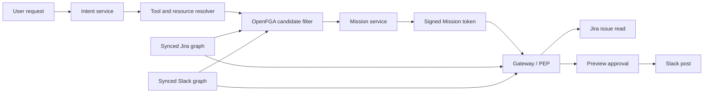

# OpenFGA Mission Gateway

Reference Go implementation of a Mission-bound gateway for agent actions.

An upstream intent service converts a user request into structured intent. This
project takes that output and enforces a narrower, expiring Mission over a
relationship graph when wired to OpenFGA.

## Example

User request:

    Read Jira issue APOLLO-17 and post a summary in #product.

Structured intent:

    jira.issue.read       jira_issue:APOLLO-17
    slack.message.post    slack_channel:product

The gateway permits a call only when:

1. the Mission is active and its signed token is valid;
2. the caller matches the Mission's agent identity;
3. the user still has access to the Jira issue or Slack channel;
4. the Mission permits that exact action and resource; and
5. a Slack post has cleared its preview approval gate.

An agent does not inherit the user's broad application permissions.

## Flow

The intent service and resolver are outside this repository. FGA does not do
semantic search or permission synchronization. It filters resolved IDs and
enforces the resulting relationships.

## Run

Requires Go 1.23+.

    git clone https://github.com/Siddhant-K-code/openfga-mission-gateway.git
    cd openfga-mission-gateway
    go test ./...
    go run ./cmd/demo

The demo walks through:

1. candidate filtering removes a Jira issue Alice cannot read;
2. the scoped Jira read succeeds;
3. the Slack post is denied pending preview approval;
4. the approved post succeeds;
5. another Slack channel is denied; and
6. removing Alice's Jira access denies the next read.

## Layout

    cmd/demo/                 runnable example
    internal/mission/         Mission service, gateway, FGA adapters, tests
    model.fga                 OpenFGA model
    tuples.json               durable Jira and Slack example relationships

The Mission service writes Mission-specific tuples when a user approves a
Mission. The default tests use an in-memory evaluator; OpenFGAHTTP calls the
standard Check and Write APIs for a live store.

## Scope

Included:

- agent identity bound to a Mission;
- action and resource attenuation;
- expiry, completion, and revocation state;
- current permission checks at action time; and
- preview approval before a Slack egress action.

Not included:

- intent classification or embeddings;
- OAuth or an AAuth Person Server;
- Jira, Slack, or MCP transport adapters;
- permission-sync connectors;
- persistence, UI, child Missions, or cross-domain delegation.

## License

MIT
