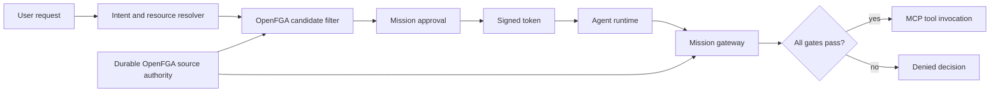

# OpenFGA Mission Gateway

Reference Go implementation of a policy enforcement point for MCP tool calls.
A Mission gives one agent a short-lived, explicit set of canonical calls. The
gateway evaluates that authority before it invokes an MCP tool.

The engine is domain-agnostic. It models MCP servers, tools, and calls rather
than Jira, Slack, or application-specific resource types.

## Trust Model

A Mission binds:

- a requester, such as `user:alice`;
- a workload identity, such as `agent:triage`;
- canonical MCP calls: server, tool, and policy-relevant input scope;
- expiry and lifecycle state; and
- per-call output approval where required.

The gateway allows a call only when every gate passes:

| Gate | Source of truth | Purpose |
| --- | --- | --- |
| Token validity | HMAC-signed Mission token | Identifies the Mission, agent, version, expiry, and permitted call IDs. |
| Mission state | Mission service | Makes revocation, completion, and approval changes effective immediately. |
| Agent binding | Token-derived contextual tuple | Prevents another agent from reusing the token. |
| Current user authority | Durable OpenFGA relationships | The requester must still be allowed to invoke the canonical call. |
| Mission scope | Token-derived contextual tuple | Restricts the agent to an exact permitted call. |
| Output approval | Mission service | Requires requester approval before a configured side effect. |

The agent never sends FGA tuples or self-asserts a scope. The gateway verifies
the token and derives contextual tuples itself.

## Canonical Calls

An upstream resolver turns a request into a canonical call. It decides which
input fields matter to policy and passes only those fields in `scope`.

```json
{
  "server": "work-tracker",
  "tool": "get_issue",
  "scope": {
    "issue_id": "APOLLO-17"
  }
}
```

The implementation hashes the server, tool, and sorted scope into an
`mcp_call:<hash>` ID. A call to another issue, channel, tenant, or query shape
has a different ID. This prevents a permitted tool from being combined with an
unrelated target.

The resolver may use semantic or keyword search to find candidate calls. The
gateway does not. `FilterAuthorizedCandidates` removes candidates the
requester cannot currently invoke.

## Durable and Contextual Data

Durable OpenFGA data represents application authority:

```text
user:alice                 operator      mcp_server:<work-tracker>
mcp_server:<work-tracker>  server        mcp_tool:<get-issue>
mcp_tool:<get-issue>       tool          mcp_call:<apollo-17>
```

After Mission approval, the service issues a signed token. It does not write
Mission scope to OpenFGA. For every authorization request, the gateway derives
and supplies these contextual tuples:

```text
user:alice                 requester     mission:<id>
agent:triage               executor      mission:<id>
mcp_call:<apollo-17>       allowed_call  mission:<id>
```

This avoids one durable write and cleanup cycle per task. It does not make
Mission state offline: the gateway still reads the Mission control plane to
enforce immediate revocation and approval changes.

## Request Flow



The agent runtime submits a token and a canonical call to the gateway. The
gateway verifies the token, loads the Mission state, builds contextual tuples,
and checks both durable authority and Mission scope before forwarding the
request to an MCP adapter.

## Components

| Component | Responsibility |
| --- | --- |
| Resolver | Maps the user request to canonical calls. |
| `FilterAuthorizedCandidates` | Filters resolved calls against durable user authority. |
| `MissionService` | Creates, approves, revokes, completes, and tracks Missions. |
| `MissionTokenSigner` | Issues and verifies HMAC-signed Mission tokens. |
| OpenFGA | Evaluates durable application authority plus contextual Mission scope. |
| `Gateway` | Applies all checks immediately before a downstream tool call and records the decision. |

`OpenFGAHTTP` uses the standard OpenFGA Check and Write APIs. The default
tests use an in-memory evaluator that implements only this repository's model;
it is not a general OpenFGA evaluator.

## Run the Demo

Requires Go 1.23+.

```sh
git clone https://github.com/Siddhant-K-code/openfga-mission-gateway.git
cd openfga-mission-gateway
go test ./...
go run ./cmd/demo
```

The demo proves:

| Scenario | Expected result |
| --- | --- |
| Candidate filtering | A call on an inaccessible MCP server is removed. |
| Scoped call | The approved read call is allowed. |
| Approval gate | A side-effect call is denied before requester approval. |
| Exact scope | The same tool with another target is denied. |
| Source revocation | Removing requester authority denies the next call. |
| Contextual scope | Mission scope is never written to the durable graph. |

## Integration Shape

1. Implement a resolver or `ScopeExtractor` for each MCP tool. It must emit
   canonical IDs from policy-relevant parameters, not arbitrary raw input.
2. Store or synchronize the requester's durable application authority in
   OpenFGA.
3. Filter resolver candidates with `FilterAuthorizedCandidates`.
4. Create a draft Mission, obtain requester approval, and issue its token to
   the agent runtime.
5. Place `Gateway.Authorize` in front of every MCP tool adapter. Only forward
   calls with an allowed decision.
6. Revoke or complete the Mission when work ends. Existing tokens are denied
   on the next request.

## Repository Layout

| Path | Purpose |
| --- | --- |
| `cmd/demo` | Runnable generic MCP flow. |
| `internal/mission` | Mission service, contextual gateway, OpenFGA adapters, and tests. |
| `model.fga` | Generic MCP server, tool, call, and Mission model. |
| `tuples.json` | Illustrative durable source-authority relationships. |

## Deliberate Omissions

- Intent classification, semantic search, and source permission synchronization.
- MCP transport and application-specific `ScopeExtractor` implementations.
- Persistence and distributed Mission state.
- Delegation chains, child Missions, and cross-domain authority transfer.

## License

MIT
